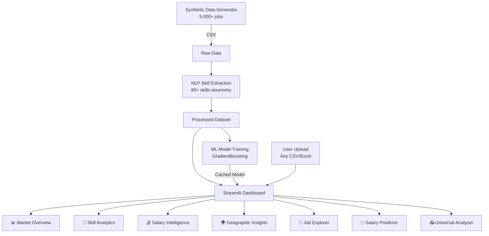

<div align="center">

# 🌍 Global Job Market Intelligence Platform

### Real-Time Analytics · NLP Skill Extraction · ML Salary Prediction

[](https://streamlit.io)
[](https://python.org)
[](https://opensource.org/licenses/MIT)
[](https://plotly.com)
[](https://scikit-learn.org)

**[🚀 Live Demo](https://global-job-market-intelligence-platform-arin.streamlit.app/)**

</div>

---

## ✨ Features

| Feature | Description |
|---------|-------------|
| **📊 Market Overview** | Interactive KPI dashboard with trend analysis, country/company breakdowns, and seniority distributions |
| **🧠 Skill Analytics** | NLP-powered extraction of 80+ skills with category heatmaps and co-occurrence analysis |
| **💰 Salary Intelligence** | Box plots, percentile analysis, skill premium insights, and top-paying company rankings |
| **🌍 Geographic Insights** | World choropleth maps, city-level analytics, and cross-country comparisons |
| **🔎 Job Explorer** | Advanced multi-filter search with styled job cards, skill badges, and CSV export |
| **🤖 Salary Predictor** | GradientBoosting ML model with cross-country predictions and feature importance |
| **📤 Universal Analyzer** | Upload any CSV/Excel for auto-analysis: distributions, correlations, time-series, scatter plots |

---

## 🏗️ Architecture



---

## 🚀 Quick Start

### Prerequisites
- Python 3.10+
- pip

### Installation

```bash
# Clone the repository
git clone https://github.com/ArinPattnaik/global-job-market-intelligence-platform.git
cd global-job-market-intelligence-platform

# Create virtual environment
python -m venv venv
venv\Scripts\activate        # Windows
# source venv/bin/activate   # Linux/Mac

# Install dependencies
pip install -r requirements.txt
```

### Generate Data (Optional — sample data included)

```bash
python data/generate_synthetic_data.py
```

### Run the Dashboard

```bash
streamlit run app.py
```

Open [http://localhost:8501](http://localhost:8501) in your browser.

---

## 📁 Project Structure

```
global-job-market-intelligence-platform/
├── app.py                          # Main landing page + CSS theme
├── pages/
│   ├── 1_Market_Overview.py        # Hiring trends dashboard
│   ├── 2_Skill_Analytics.py        # NLP skill demand analysis
│   ├── 3_Salary_Intelligence.py    # Compensation analytics
│   ├── 4_Geographic_Insights.py    # Regional comparisons
│   ├── 5_Job_Explorer.py           # Advanced job search
│   ├── 6_Salary_Predictor.py       # ML salary estimation
│   └── 7_Data_Upload_Analyzer.py   # Universal data analyzer
├── config/
│   └── settings.py                 # Configuration & constants
├── data/
│   ├── generate_synthetic_data.py  # Synthetic data generator
│   ├── raw/                        # Raw job postings
│   └── processed/                  # Processed with skills
├── nlp/
│   └── skill_extraction.py         # 80+ skill taxonomy & NLP
├── models/
│   └── train_model.py              # Multi-feature ML pipeline
├── etl/
│   └── fetch_jobs.py               # Adzuna API integration
├── scripts/
│   └── update_pipeline.py          # Pipeline orchestration
├── tests/
│   └── test_skill_extraction.py    # Unit tests
├── .streamlit/
│   └── config.toml                 # Streamlit theme
├── requirements.txt                # Python dependencies
├── Dockerfile                      # Docker deployment
└── README.md
```

---

## 🛠️ Tech Stack

- **Frontend:** Streamlit, Plotly
- **Data Processing:** Pandas, NumPy
- **NLP:** Custom 80+ skill taxonomy with category mapping
- **ML:** scikit-learn (GradientBoostingRegressor)
- **Deployment:** Streamlit Community Cloud
- **Data Source:** Synthetic (5,000+ jobs, 8 countries, 88 companies)

---

## 🐳 Docker

```bash
docker build -t job-platform .
docker run -p 8501:8501 job-platform
```

---

## 📊 Universal Data Analyzer

The platform includes a **Universal Data Analyzer** that accepts any CSV or Excel file:

1. **Auto-Detection**: Identifies numeric, categorical, datetime, and text columns
2. **Smart KPIs**: Row count, column count, missing data percentage
3. **Auto-Charts**: Generates appropriate visualizations per column type
4. **Correlations**: Heatmap + top correlated pairs
5. **Time Series**: Detects date columns for trend analysis
6. **Scatter Explorer**: Interactive X/Y/Color scatter plot builder
7. **Export**: Download analyzed data as CSV or Excel

---

## 📄 License

This project is open source under the [MIT License](LICENSE).

---

<div align="center">

**Built with ❤️ by [Arin Pattnaik](https://github.com/ArinPattnaik)**

[🌐 Live Demo](https://global-job-market-intelligence-platform-arin.streamlit.app/) · [⭐ Star on GitHub](https://github.com/ArinPattnaik/global-job-market-intelligence-platform)

</div>
